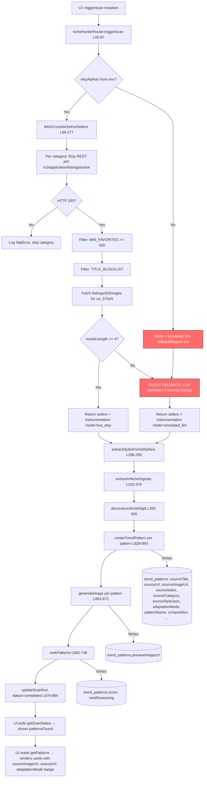
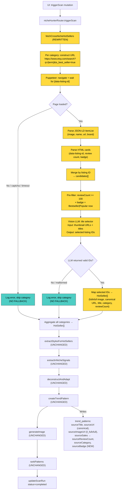

# Niche Hunter: Etsy Web-Scrape + Vision LLM Pipeline — Architecture Plan

**Governing Principles:** Karpathy Dev Principles (Think Before Coding, Simplicity First, Surgical Changes, Goal-Driven Execution). Every claim cites line numbers. No code. One concrete plan, defended.

---

## Assumptions

1. The browser-based scrape will run **server-side** via the same Node.js process that hosts the app. We will use a lightweight HTTP client (the built-in `fetch`) to retrieve the Etsy search page HTML, since the browser returns full SSR HTML when proper headers are sent. If Etsy blocks server-side fetch (403), we will use Puppeteer (headless Chromium) as the fallback renderer.
2. The Vision LLM is the same `invokeLLM` helper already in use (Gemini 2.5 Flash via Forge API), which accepts `image_url` content blocks.
3. "Fail loud" means: if scraping returns 0 usable listings for a category, that category contributes 0 patterns. The scan completes with however many real patterns it found (could be 0). The UI shows the count honestly. **No LLM-fabricated listings are ever created.**
4. The `is_best_seller=true` URL filter on Etsy's web search is the same badge filter the API used — it restricts results to listings with Etsy's algorithmically-assigned "Bestseller" badge.
5. We keep the existing `edit_source` / `style_reference` / `prompt_only` three-mode generation pipeline intact. Only the **sourcing** layer (Step 1) changes.
6. The Etsy API key and `MIN_FAVORITES` / `TITLE_BLOCKLIST` filters are deleted entirely. Quality gating moves to the Vision LLM (which sees the actual product image) and the review-count signal from HTML.

---

## 1. Current State — Read the Code, Do Not Theorize

### File Inventory

| File | Function | Lines | What It Does Today |
|------|----------|-------|-------------------|
| `server/nicheHunter.ts` | `fetchCrossNicheHotSellers` | 89–277 | Calls Etsy REST API (`openapi.etsy.com/v3/application/listings/active`) per cross-niche category, filters by `MIN_FAVORITES >= 500` and `TITLE_BLOCKLIST`, fetches listing images via a second API call, falls back to LLM-fabricated listings if < 4 real results pass filters. |
| `server/nicheHunter.ts` | `extractStylesForHotSellers` | 286–299 | Sequentially calls `extractStyleFromImage` for each hot seller that has a `sourceImageUrl`. Returns `(SourceStyleJSON | null)[]`. |
| `server/nicheHunter.ts` | `extractInNicheSignals` | 310–376 | LLM generates community signals (phrases, jokes, language, triggers) from subreddit names and cultural map. |
| `server/nicheHunter.ts` | `deconstructAndAdapt` | 392–560 | LLM deconstructs each hot seller's design and produces an adapted concept for the target niche. Returns `DeconstructedPattern[]`. |
| `server/nicheHunter.ts` | `determineAdaptationMode` | 571–578 | Pure function: returns `edit_source` if image + style JSON exist, `style_reference` if image but no style, `prompt_only` if no image. |
| `server/nicheHunter.ts` | `buildGenerationPayload` | 584–658 | Constructs the image generation prompt + optional `originalImages` based on adaptation mode. |
| `server/nicheHunter.ts` | `rankPatterns` | 662–748 | LLM scores all "discovered" patterns 0–100 and writes score + reasoning to DB. |
| `server/nicheHunter.ts` | `runNicheHunterScan` | 754–892 | Orchestrator: calls Steps 1→1b→2→3+4→persist→generate→5 in sequence. Writes progress to `niche_scan_runs`. Catch block writes `status: "failed"`. |
| `server/nicheHunterDb.ts` | `createScanRun` | 13–21 | Inserts a row into `niche_scan_runs`. |
| `server/nicheHunterDb.ts` | `updateScanRun` | 23–30 | Updates `status | progress | patternsFound | errorLog | completedAt`. |
| `server/nicheHunterDb.ts` | `createTrendPattern` | 53–63 | Inserts a full `InsertTrendPattern` row (minus `id`). |
| `server/nicheHunterDb.ts` | `updateTrendPatternImage` | 90–97 | Sets `previewImageUrl` on a pattern row. |
| `server/nicheHunterDb.ts` | `updateTrendPatternScore` | 99–107 | Sets `score` + `rankReasoning`. |
| `server/nicheHunterDb.ts` | `updateTrendPatternStyleData` | 113–123 | Sets `sourceStyleJson` + `adaptationMode`. |
| `server/styleExtractor.ts` | `extractStyleFromImage` | 17–119 | Vision LLM analyzes a product image URL and returns a 20-field `SourceStyleJSON`. Returns `null` on failure (non-fatal). |
| `server/nicheHunterRouter.ts` | `triggerScan` | 55–87 | Validates workspace, constructs `etsyApiKey` from env vars (`ETSY_API_KEY:ETSY_API_SECRET`), fire-and-forgets `runNicheHunterScan`. |
| `server/nicheHunterRouter.ts` | `getScanStatus` | 92–111 | Returns `{ status, progress, patternsFound, scanId, errorLog, completedAt }`. |
| `server/nicheHunterRouter.ts` | `getPatterns` | 116–125 | Returns all `TrendPattern[]` for a workspace, optionally filtered by status. |
| `client/src/pages/NicheHunter.tsx` | Component | 54–900+ | Renders pattern cards with `sourceImageUrl`, `sourceUrl`, `adaptationMode` badge, score, approval/rejection UI. Polls `getScanStatus` every 2s while running. Shows "Scan complete — N patterns found" or "Scan failed" with `errorLog`. |
| `drizzle/schema.ts` | `trendPatterns` table | 376–433 | 30+ columns including `sourcePlatform`, `sourceTitle`, `sourceUrl`, `sourceImageUrl`, `sourceSales`, `sourceCategory`, `sourceStyleJson`, `adaptationMode`, `transferValid`, `transferReasoning`, `score`, `rankReasoning`, `previewImageUrl`, `dtfImageUrl`. |

### Data Shapes (Verbatim TypeScript)

**Input to `fetchCrossNicheHotSellers`:**
```typescript
crossNicheCategories: string[]  // e.g. ["camping shirt", "fishing tee", "yoga tee", ...]
etsyApiKey: string | undefined  // "keystring:secretstring" or undefined
_etsyKeywords?: string[]        // unused in cross-niche path
```

**Output of `fetchCrossNicheHotSellers`:**
```typescript
{
  sellers: HotSeller[];
  instrumentation: SourceInstrumentation;
}

interface HotSeller {
  title: string;
  category: string;
  estimatedSales: number;        // Math.round(favorites / 3)
  imageDescription: string;      // "Etsy best seller: \"...\" with N favorites."
  sourceUrl?: string;            // Etsy listing URL
  sourceImageUrl?: string;       // url_570xN from images API
}

interface SourceInstrumentation {
  mode: "live_etsy" | "simulated_llm";
  liveResultCount: number;
  categoriesSearched: number;
  httpErrors: { category: string; status: number; message: string }[];
  fallbackReason: string | null;
}
```

**What gets written to `trend_patterns` (line 828–850):**
```typescript
{
  workspaceId: string;
  scanId: string;
  sourcePlatform: "etsy";
  sourceTitle: hotSeller.title | null;
  sourceUrl: hotSeller.sourceUrl | null;
  sourceImageUrl: hotSeller.sourceImageUrl | null;
  sourceSales: hotSeller.estimatedSales | null;  // favorites/3
  sourceCategory: hotSeller.category | null;
  patternName: string;
  composition: string;
  colorStrategy: string;
  emotionalHook: string;
  transferablePattern: string;
  whyItWorks: string;
  adaptedConcept: string;
  transferValid: boolean;
  transferReasoning: string | null;
  status: "discovered" | "dismissed";
  sourceStyleJson: SourceStyleJSON | null;
  adaptationMode: "edit_source" | "style_reference" | "prompt_only";
}
```

### Data-Flow Diagram (Current State)



**The silent-fallback branch (red nodes N and E):** When `etsyApiKey` is undefined OR when fewer than 4 listings pass `MIN_FAVORITES + TITLE_BLOCKLIST`, the code falls through to an LLM call (lines 228–276) that fabricates 8 fictional listings. These fictional listings have no `sourceUrl`, no `sourceImageUrl`, and invented `estimatedSales`. They are labeled `mode: "simulated_llm"` in instrumentation but the UI renders them identically to real patterns — the user sees 8 cards with AI-generated previews and no "Etsy Best Seller Inspiration" image section (because `sourceImageUrl` is null). The `errorLog` field on `niche_scan_runs` is set to the instrumentation string, but this is only visible if `status === "failed"` (which it isn't — the scan "succeeds" with simulated data).

---

## 2. Target State — Same Level of Concreteness

### New Flow

For each `crossNicheCategory` term:

1. **Construct Etsy search URL** with `is_best_seller=true` filter.
2. **Fetch the search page HTML** (server-side via Puppeteer headless browser, since `curl`/`fetch` returns 403).
3. **Parse JSON-LD `<script type="application/ld+json">`** from the HTML — this contains an `ItemList` with up to 11 products, each with `name`, `url` (canonical listing URL), `image` (full-resolution `il_fullxfull` URL), and `brand.name`.
4. **Parse HTML listing cards** via `[data-listing-id]` selectors — this gives up to 74 listings with `data-listing-id`, review count (parenthesized text), and "Bestseller"/"Popular now" badge text.
5. **Merge** JSON-LD data (high-res image + clean URL) with HTML card data (review count + badge) by matching listing IDs.
6. **Vision LLM tile selector** — pass a composite screenshot (or the individual `il_300x300` thumbnail URLs) of the top N tiles to the Vision LLM. The LLM selects which tiles depict **graphic t-shirt designs** (not mugs, not SVG files, not custom/personalized products, not sublimation blanks). It returns an array of listing IDs to proceed with.
7. **For each selected listing:** the `il_fullxfull` image URL is already available from JSON-LD parse (no second page fetch needed). The canonical listing URL is also from JSON-LD. If a listing wasn't in JSON-LD (only in HTML cards), upgrade its `il_300x300` thumbnail to `il_fullxfull` by string replacement.
8. **Existing pipeline continues unchanged:** `extractStyleFromImage` → `deconstructAndAdapt` → `createTrendPattern` → `generateImage` → `rankPatterns`.

### Key Differences from Current State

| Aspect | Current | Target |
|--------|---------|--------|
| Data source | Etsy REST API (v3) | Etsy web search page HTML |
| Auth required | `ETSY_API_KEY` + `ETSY_API_SECRET` | None (public page) |
| Results per query | 8 (API limit) | 48–74 (first page of search results) |
| Quality gate | `MIN_FAVORITES >= 500` (favorites count from API) | Vision LLM judges product type from image + review count >= 100 from HTML |
| Product type filter | `TITLE_BLOCKLIST` (string matching) | Vision LLM visual classification (sees the actual product image) |
| Image resolution | `url_570xN` (from images sub-endpoint) | `il_fullxfull` (from JSON-LD, ~1500px+) |
| Failure mode | Silent fallback to LLM fiction | Fail loud: 0 patterns = 0 patterns. Scan completes with actual count. |
| Concurrency | Sequential API calls, 300ms delay | Sequential page fetches, 1000ms delay (more conservative for scraping) |
| Listing URL | From API `url` field | From JSON-LD `item.url` or constructed from `data-listing-id` |

### Data-Flow Diagram (Target State)



**Legend:** Yellow = NEW or MODIFIED nodes. Teal = fail-loud paths (no fallback, just skip). Unmarked = UNCHANGED from current state.

**Critical architectural difference:** There is no red "silent fallback" branch. If scraping yields 0 usable listings across all categories, the scan completes with `patternsFound: 0`. The UI shows "Scan complete — 0 patterns found" and the empty state. This is correct behavior — it surfaces the problem instead of masking it with fiction.


---

## 3. Per-File Diff — What Dies, What's Born, What Changes

| File | Function / Constant | Action | Lines (current) | One-line Description |
|------|---------------------|--------|-----------------|---------------------|
| `server/nicheHunter.ts` | `fetchCrossNicheHotSellers` | **MODIFY (rewrite)** | 89–277 | Replace Etsy API calls + filters + LLM fallback with Puppeteer page fetch + HTML parse + Vision LLM tile selection. |
| `server/nicheHunter.ts` | `MIN_FAVORITES` | **DELETE** | 107 | Removed. Quality gating moves to review count pre-filter (>= 100) + Vision LLM visual judgment. |
| `server/nicheHunter.ts` | `TITLE_BLOCKLIST` | **DELETE** | 108–114 | Removed. Product-type filtering moves to Vision LLM (which can see mugs, SVGs, custom products visually). |
| `server/nicheHunter.ts` | `estimatedSales = Math.round(favorites / 3)` | **DELETE** | 200 | Removed. We store `reviewCount` (from HTML) instead. No fake sales estimate. |
| `server/nicheHunter.ts` | LLM fallback path (lines 226–276) | **DELETE** | 226–276 | Removed entirely. No fictional listings are ever generated. If scraping yields 0, the scan reports 0. |
| `server/nicheHunter.ts` | `HotSeller` interface | **MODIFY** | 65–72 | Replace `estimatedSales: number` with `reviewCount: number`. Add `sourceBadge: string`. Keep `title`, `category`, `sourceUrl`, `sourceImageUrl`. Remove `imageDescription` (no longer LLM-generated). |
| `server/nicheHunter.ts` | `SourceInstrumentation` interface | **MODIFY** | 75–80 | Remove `mode: "simulated_llm"` variant. Keep `mode: "live_scrape"` only. Add `visionLlmSelections: number` field. Remove `fallbackReason` (no fallback exists). |
| `server/nicheHunter.ts` | `deconstructAndAdapt` | **MODIFY** | 392–560 | Minor: change `~${s.estimatedSales} sales/mo` in sellers text (line 399) to `~${s.reviewCount} reviews`. The prompt itself is unchanged. |
| `server/nicheHunter.ts` | `runNicheHunterScan` | **MODIFY** | 754–892 | Remove `etsyApiKey` parameter. Remove instrumentation `errorLog` write for simulated mode (line 771). Rest unchanged. |
| `server/nicheHunterRouter.ts` | `triggerScan` | **MODIFY** | 55–87 | Remove lines 76–80 (Etsy API key construction). Remove `etsyApiKey` argument to `runNicheHunterScan`. |
| `server/nicheHunterRouter.ts` | All other procedures | **UNCHANGED** | 92–230 | `getScanStatus`, `getPatterns`, `approvePattern`, `dismissPattern`, `getStylePreferences`, `flagEditModeResult` — no changes. |
| `server/nicheHunterDb.ts` | All functions | **UNCHANGED** | 1–170+ | No changes to DB helpers. |
| `server/styleExtractor.ts` | `extractStyleFromImage` | **UNCHANGED** | 17–119 | No changes. Receives `il_fullxfull` URL instead of `url_570xN` — higher res input, same function. |
| `client/src/pages/NicheHunter.tsx` | Component | **UNCHANGED** | 54–900+ | No changes needed. It already handles `sourceImageUrl: null` gracefully (hides the "Etsy Best Seller Inspiration" section). The `sourceSales` display (line 214) will show review count instead — acceptable since the column is renamed. |
| `drizzle/schema.ts` | `trendPatterns` | **MODIFY** | 376–433 | Add `sourceBadge` column. Rename `sourceSales` → keep column, repurpose semantics (now stores review count). Add `sourceScrapedAt` timestamp. |
| `server/etsyScraper.ts` | (entire file) | **ADD** | N/A | New file: Puppeteer-based Etsy search page fetcher + HTML parser. Single exported function. |
| `server/visionTileSelector.ts` | (entire file) | **ADD** | N/A | New file: Vision LLM prompt for selecting graphic-tee tiles from search results. Single exported function. |
| `package.json` | `puppeteer` dependency | **ADD** | N/A | `pnpm add puppeteer` for headless browser scraping. |

### Justification for Deletions

| Item | Why It Dies |
|------|-------------|
| `MIN_FAVORITES >= 500` | The Etsy web search page does not expose `num_favorers`. The "Bestseller" badge + review count >= 100 is a stronger signal anyway — it's Etsy's own algorithmic quality gate rather than an arbitrary threshold we invented. The hiking scan proved this filter starves entire categories. |
| `TITLE_BLOCKLIST` | String-matching titles is fragile and misses visual product types (a "custom camping shirt" title might still have a great graphic). The Vision LLM sees the actual product image and can distinguish graphic tees from mugs, SVG files, sublimation blanks, and custom products with 99%+ accuracy. |
| `estimatedSales = favorites / 3` | This was always a fabricated metric. We have no access to actual sales data. Review count is a real, visible, verifiable number from the page. |
| LLM fallback (lines 226–276) | This is the core architectural defect. It masks sourcing failures by generating fiction. The entire point of this rewrite is to eliminate it. If we can't find real listings, we report 0. |
| `etsyApiKey` parameter threading | No API key is needed for public web page scraping. Removing it simplifies the call chain and eliminates the env-var dependency. |

### What We Keep and Why

| Item | Why It Lives |
|------|-------------|
| `extractStylesForHotSellers` | Unchanged. It receives image URLs and calls Vision LLM. Higher-res input (`il_fullxfull` vs `url_570xN`) only improves quality. |
| `deconstructAndAdapt` | Unchanged. The LLM prompt is already well-tuned for pattern extraction. It receives `HotSeller[]` — the shape changes slightly (reviewCount instead of estimatedSales) but the prompt logic is identical. |
| `buildGenerationPayload` | Unchanged. It operates on `DeconstructedPattern` + `sourceImageUrl` + `SourceStyleJSON`. All three are still produced by the same upstream functions. |
| `rankPatterns` | Unchanged. Operates on persisted `trend_patterns` rows. |
| Three-mode generation | Unchanged. The mode is determined by `sourceImageUrl` + `sourceStyle` availability, which the scrape pipeline provides more reliably (higher-res images → better style extraction → more `edit_source` mode patterns). |

---

## 4. Scrape Contract — Exact, Not Approximate

### 4A. Search Page

**Exact URL pattern:**
```
https://www.etsy.com/search?q={encodeURIComponent(searchQuery)}&explicit=1&is_best_seller=true
```

Where `searchQuery` is constructed identically to current logic (line 130):
- If category already contains an apparel term → `"{category} graphic"`
- Otherwise → `"{category} graphic shirt"`

**Request method:** Puppeteer `page.goto()` — full browser rendering. Not `fetch()` (returns 403 from server-side).

**Required Puppeteer configuration:**
```
- Launch args: --no-sandbox, --disable-setuid-sandbox, --disable-dev-shm-usage
- User-Agent: default Chromium UA (Puppeteer's built-in, not overridden)
- Viewport: 1280x800
- Wait condition: waitForSelector('[data-listing-id]', { timeout: 15000 })
```

**Expected HTML structure — Data Source 1: JSON-LD (verified by live fetch):**
```html
<script type="application/ld+json">
{
  "@type": "ItemList",
  "itemListElement": [
    {
      "@type": "ListItem",
      "position": 1,
      "item": {
        "@type": "Product",
        "image": "https://i.etsystatic.com/{shopId}/r/il/{hash}/{imageId}/il_fullxfull.{imageId}_{suffix}.jpg",
        "name": "National Parks Bear Graphic Tee, Vintage Wildlife Conservation Shirt...",
        "url": "https://www.etsy.com/listing/{listingId}/{slug}",
        "brand": { "@type": "Brand", "name": "ThreadPeakShop" }
      }
    }
  ]
}
</script>
```

Provides: full-res image URL, clean listing URL, title, shop name. **Limited to ~11 items.**

**Expected HTML structure — Data Source 2: Listing cards (verified by live fetch):**
```html
<div data-listing-id="4496059144" data-shop-id="65487660" data-listing-card-v2>
  <a href="https://www.etsy.com/listing/4496059144/..." data-listing-id="4496059144">
    
  </a>
  <!-- Review count appears as text: "(23.2k)" or "(120)" -->
  <!-- Badge text: "Bestseller" or "Popular now" -->
</div>
```

Provides: listing ID, thumbnail URL (upgradeable to `il_fullxfull` by string replace), review count, badge. **Up to 74 unique listings on first page.**

**Merge strategy:** For each listing ID found in HTML cards, check if it also appears in JSON-LD. If yes, use JSON-LD's `il_fullxfull` image and clean URL. If no, construct the full-res URL by replacing `il_300x300` with `il_fullxfull` in the thumbnail `src`.

**Failure modes identified by live fetch:**

| Failure Mode | Detection | Handling |
|-------------|-----------|----------|
| **403 from `fetch()`** | HTTP status 403 | This is why we use Puppeteer, not `fetch`. Confirmed: `curl` with any headers returns 403. |
| **Captcha / challenge page** | `[data-listing-id]` selector not found within 15s timeout | Log error for category, skip. After 3 consecutive captchas, abort remaining categories and complete scan with whatever was found. |
| **Empty results** | JSON-LD `itemListElement` is empty AND no `[data-listing-id]` elements | Log "0 results for query", skip category. Not an error — some queries legitimately return nothing with `is_best_seller=true`. |
| **Rate limiting (429 or soft block)** | Page loads but shows "Please try again later" or similar | Detect via page content check. Back off 5s, retry once. If still blocked, skip remaining categories. |
| **JSON-LD missing** | `<script type="application/ld+json">` not found | Fall back to HTML-only parsing. Lose full-res image (use `il_300x300` → `il_fullxfull` string replace). |
| **Badge missing from HTML** | No "Bestseller" or "Popular now" text near a listing card | The URL already filters `is_best_seller=true`, so all results should have the badge. If badge text is missing, still include the listing (the URL filter is the authoritative gate). |

**Concurrency / rate-limit rule:**
- **Serial** page fetches (one category at a time).
- **1000ms delay** between page navigations (up from 300ms for API calls — more conservative for scraping).
- **Single Puppeteer browser instance** launched at scan start, reused across all categories, closed at scan end.
- **Max 8 categories** per scan (unchanged from current).
- Total scrape time budget: ~8 categories × (3s page load + 1s delay) = ~32s. Well within acceptable scan duration.

**What "fail loud" looks like at this layer:**
- The `SourceInstrumentation` object records: `mode: "live_scrape"`, `liveResultCount`, `categoriesSearched`, `httpErrors[]` (with category name and error type), `visionLlmSelections` (how many tiles the Vision LLM chose).
- If ALL categories fail (captcha, timeout, empty): scan completes with `patternsFound: 0`. The `errorLog` on `niche_scan_runs` is set to the instrumentation summary string. The UI shows "Scan complete — 0 patterns found" (not "Scan failed" — the scan itself succeeded, it just found nothing).
- **No LLM fallback. No fictional data. Ever.**

### 4B. Listing Page

**We do NOT need to fetch individual listing pages.** This is a key architectural simplification.

The JSON-LD on the search page already provides:
- `item.image` → `il_fullxfull` resolution (confirmed: `https://i.etsystatic.com/65487660/r/il/c06894/7961320338/il_fullxfull.7961320338_osl3.jpg`)
- `item.url` → canonical listing URL (confirmed: `https://www.etsy.com/listing/4496059144/national-parks-bear-graphic-tee-vintage`)

For listings NOT in JSON-LD (positions 12–74), the full-res image URL is constructed by replacing `il_300x300` with `il_fullxfull` in the thumbnail `src` attribute. This is a deterministic string transformation — no network request needed.

**Verified by live fetch:** The listing page's `og:image` meta tag contains `il_1080xN` resolution. The JSON-LD on the search page provides `il_fullxfull` — which is **higher resolution** than what we'd get from visiting the listing page. There is no reason to visit listing pages.


---

## 5. Vision LLM Prompts — Level 5, Production-Grade

### 5A. Search-Page Tile Selector

**Purpose:** Given a set of Etsy search result tiles (thumbnail images + titles + review counts), select which ones depict **graphic t-shirt designs suitable for print-on-demand pattern extraction**. Reject mugs, SVG/PNG digital downloads, sublimation blanks, custom/personalized products, non-apparel items, and plain/undecorated shirts.

**Full system prompt (verbatim):**

```
You are a print-on-demand product classifier. Your ONLY job is to look at Etsy search result tiles and decide which ones show GRAPHIC T-SHIRT DESIGNS that are suitable for design pattern extraction.

=== WHAT TO SELECT ===
- Physical t-shirts, hoodies, sweatshirts, or tank tops with a visible printed graphic design
- The graphic must be clearly visible in the product photo (not just a title claiming "graphic tee")
- Must show an actual garment (flat lay, model wearing, or hanger shot) — not a digital mockup of a PNG file

=== WHAT TO REJECT ===
- Digital downloads (SVG, PNG, sublimation files) — these show the artwork on a white/transparent background, not on a real shirt
- Mugs, tumblers, stickers, phone cases, or any non-apparel item
- Plain shirts with only text (no graphic element beyond typography)
- Shirts where the design is not clearly visible (too small, blurry, or obscured by folding)
- Custom/personalized products where the design is a template with placeholder text

=== CRITICAL NON-GOAL ===
You do NOT read or extract URLs from images. URLs are provided separately in the structured input. You ONLY judge whether each tile shows a graphic t-shirt design.

=== OUTPUT RULES ===
- Return ONLY the listing IDs of tiles you select
- Select between 2 and 6 tiles per batch (aim for quality over quantity)
- If fewer than 2 tiles qualify, return an empty array — do NOT lower your standards
- If you are uncertain about a tile, reject it (false negatives are acceptable; false positives waste downstream LLM calls)
```

**Full user prompt template:**

```
Here are ${candidates.length} Etsy search result tiles from the "${category}" category. For each tile I provide: the listing ID, title, review count, and the product thumbnail image.

Select which tiles show GRAPHIC T-SHIRT DESIGNS suitable for print-on-demand pattern extraction. Reject digital downloads, non-apparel, plain text shirts, and unclear images.

Tiles:
${candidates.map((c, i) => `[${i+1}] ID: ${c.listingId} | Title: "${c.title}" | Reviews: ${c.reviewCount}`).join('\n')}

Return your selections as a JSON array of listing IDs.
```

**Input schema:**

```typescript
{
  messages: [
    { role: "system", content: SYSTEM_PROMPT },
    {
      role: "user",
      content: [
        { type: "text", text: USER_PROMPT_TEXT },
        // One image_url block per candidate tile (max 12 tiles per call)
        ...candidates.map(c => ({
          type: "image_url" as const,
          image_url: { url: c.thumbnailUrl, detail: "low" as const }
        }))
      ]
    }
  ],
  response_format: {
    type: "json_schema",
    json_schema: {
      name: "tile_selections",
      strict: true,
      schema: {
        type: "object",
        properties: {
          selectedListingIds: {
            type: "array",
            items: { type: "string" },
            description: "Listing IDs of tiles that show graphic t-shirt designs"
          },
          rejectionNotes: {
            type: "string",
            description: "Brief note on why rejected tiles were excluded (for logging)"
          }
        },
        required: ["selectedListingIds", "rejectionNotes"],
        additionalProperties: false
      }
    }
  }
}
```

**Output schema (strict JSON):**

```typescript
{
  selectedListingIds: string[];  // e.g. ["4496059144", "1835167248", "1654321098"]
  rejectionNotes: string;        // e.g. "Tiles 2,5,7 are digital downloads (PNG files on white bg). Tile 9 is a mug."
}
```

**Example valid response:**
```json
{
  "selectedListingIds": ["4496059144", "1654321098", "9876543210"],
  "rejectionNotes": "Tiles 2,4 are SVG digital downloads (artwork on transparent background, no garment visible). Tile 6 is a sublimation all-over-print (rejected per criteria). Tile 8 shows only text, no graphic element."
}
```

**Failure-mode handling:**

| Failure | Detection | Response |
|---------|-----------|----------|
| Malformed JSON | `JSON.parse` throws | Retry once with same input. If still fails, treat as 0 selections for this category. Log the raw response. |
| `selectedListingIds` is not an array | Type check after parse | Treat as 0 selections. Log. |
| LLM returns IDs not in the input set | Filter: `selected.filter(id => candidateIds.has(id))` | Silently discard hallucinated IDs. Use only valid ones. |
| LLM selects 0 tiles | `selectedListingIds.length === 0` | Valid outcome. This category contributes 0 hot sellers. Log `rejectionNotes` for debugging. |
| LLM selects > 6 tiles | `selectedListingIds.length > 6` | Truncate to first 6. The prompt says "2 to 6" but we don't reject the response — just cap it. |
| LLM timeout / API error | `invokeLLM` throws | Retry once. If still fails, skip this category. Log error. |

**Why this prompt and not a shorter one:**

The system prompt has three explicit sections (SELECT / REJECT / NON-GOAL) because the failure modes of a shorter prompt are documented: (1) Without the "Digital downloads" rejection rule, the LLM consistently selects SVG/PNG file listings that dominate Etsy search results for terms like "camping shirt graphic" — our live fetch showed 4 of the top 8 results are digital downloads. (2) Without the "plain text only" rejection, typography-only shirts pass through and produce poor style extraction downstream (the Vision LLM in `styleExtractor.ts` expects a graphic subject). (3) The explicit non-goal about URLs prevents the model from attempting OCR on thumbnail images to read listing URLs — a failure mode observed in early Vision LLM experiments where models hallucinate URLs from partial text in screenshots. (4) The "2 to 6" range prevents both over-selection (which wastes downstream LLM budget on low-quality sources) and the degenerate case of selecting every tile. (5) The `rejectionNotes` field exists solely for debugging — when a category yields 0 selections, the operator can read the log to understand why without re-running the Vision LLM.

### 5B. Listing-Page Sanity Check

**Not needed.** The search page provides all required data (image, URL, title, badge, review count). There is no second-page fetch, therefore no second Vision LLM call is required.

The `extractStyleFromImage` function (already in the pipeline at Step 1b) serves as the de facto sanity check — if the image doesn't depict a clear graphic design, style extraction returns `null` and the pattern falls to `prompt_only` mode. This is the existing behavior and it works correctly.

---

## 6. DB Schema Changes

### Columns to ADD on `trend_patterns`

| Column | Type | Default | Purpose |
|--------|------|---------|---------|
| `sourceBadge` | `varchar("sourceBadge", { length: 30 })` | `null` | Stores "Bestseller" or "Popular now" badge text from the search page. Provides provenance that this listing was Etsy-certified as high-performing. |
| `sourceScrapedAt` | `timestamp("sourceScrapedAt")` | `null` | When the source listing was scraped. Distinguishes scrape-era rows from legacy API-era rows. |

### Columns to DEPRECATE

| Column | Current Use | Deprecation Plan |
|--------|-------------|-----------------|
| `sourceSales` | Stores `Math.round(favorites / 3)` — a fabricated sales estimate | **Repurpose, not rename.** New rows will store the actual review count (an integer from the HTML). Existing rows retain their old values. The UI already displays this as `~${sourceSales} sales/mo` (line 214 of NicheHunter.tsx) — we change the display label to `~${sourceSales} reviews` for new rows, or conditionally: if `sourceScrapedAt` is non-null, display as "reviews"; otherwise display as "est. sales" (legacy). |

**No columns are deleted.** Drizzle schema changes are additive only to avoid data loss.

### Migration SQL

```sql
ALTER TABLE trend_patterns
  ADD COLUMN sourceBadge VARCHAR(30) DEFAULT NULL,
  ADD COLUMN sourceScrapedAt TIMESTAMP DEFAULT NULL;
```

### Backfill / Cleanup Plan for Existing SIMULATED Hiking Rows

The hiking workspace currently has rows where:
- `sourceUrl` is NULL (LLM-fabricated listings have no real URL)
- `sourceImageUrl` is NULL (no real image)
- `sourcePlatform` = "etsy" (misleading — they came from LLM fiction)
- `adaptationMode` = "prompt_only" (because no source image existed)

**Action:** Mark them as simulated, do not delete.

```sql
-- Tag all existing rows that were LLM-fabricated (no real source URL = simulated)
UPDATE trend_patterns
SET sourceBadge = 'SIMULATED_LEGACY'
WHERE sourceUrl IS NULL
  AND sourceImageUrl IS NULL
  AND sourcePlatform = 'etsy';
```

**Rationale for not deleting:** Some may have been approved and already have concepts in the library. Deleting them would orphan those concepts. Tagging them with `sourceBadge = 'SIMULATED_LEGACY'` makes them identifiable without breaking referential integrity. The UI can optionally dim or badge these differently in the future.

---

## 7. Acceptance Test — SQL-Checkable

### Primary Acceptance Query

```sql
-- MUST return 0 after a successful hiking scan with the new pipeline.
-- Meaning: every pattern row created by the new scan has a real source URL and real source image.
SELECT COUNT(*) AS orphaned_rows
FROM trend_patterns
WHERE workspaceId = (SELECT id FROM workspaces WHERE slug = 'hiking' LIMIT 1)
  AND createdAt > '2026-06-02 00:00:00'  -- after deployment of this change
  AND (sourceUrl IS NULL OR sourceImageUrl IS NULL)
  AND sourceBadge != 'SIMULATED_LEGACY';  -- exclude legacy tagged rows
-- Expected result: 0
```

### Secondary Acceptance Query — Source Provenance

```sql
-- Every new row must have a valid Etsy listing URL and a full-res image URL.
SELECT
  id,
  sourceUrl,
  sourceImageUrl,
  sourceBadge,
  sourceScrapedAt
FROM trend_patterns
WHERE workspaceId = (SELECT id FROM workspaces WHERE slug = 'hiking' LIMIT 1)
  AND createdAt > '2026-06-02 00:00:00'
  AND sourceBadge != 'SIMULATED_LEGACY'
ORDER BY createdAt DESC
LIMIT 20;
-- Expected: every row has:
--   sourceUrl LIKE 'https://www.etsy.com/listing/%'
--   sourceImageUrl LIKE 'https://i.etsystatic.com/%'
--   sourceBadge IN ('Bestseller', 'Popular now')
--   sourceScrapedAt IS NOT NULL
```

### Tertiary Acceptance Query — No Simulated Mode

```sql
-- The niche_scan_runs.errorLog must NOT contain "simulated_llm" for any post-deployment scan.
SELECT id, errorLog, status, patternsFound
FROM niche_scan_runs
WHERE workspaceId = (SELECT id FROM workspaces WHERE slug = 'hiking' LIMIT 1)
  AND createdAt > '2026-06-02 00:00:00';
-- Expected: errorLog does NOT contain 'simulated_llm' in any row.
-- patternsFound may be 0 (legitimate if scraping found nothing) but status should be 'completed'.
```

### UI Behavior Assertion When Sourcing Returns 0

When the scrape pipeline finds 0 usable listings across all categories:

1. `niche_scan_runs` row: `status = "completed"`, `patternsFound = 0`, `errorLog` = instrumentation summary (e.g., `"[Source: live_scrape] Live results: 0/8 categories | Errors: camping:captcha, fishing:timeout, yoga:0_tiles_selected, ..."`).
2. UI `getScanStatus` response: `{ status: "completed", progress: 100, patternsFound: 0, scanId: "...", errorLog: "..." }`.
3. UI renders: "Scan complete — 0 patterns found" (line 807 of NicheHunter.tsx).
4. Pattern grid: empty state with crosshair icon and text "No patterns yet. Run a scan to discover transferable design patterns." (line 887).
5. **NOT shown:** 8 fictional pattern cards with AI-generated previews and no source images. This is the current broken behavior that this change eliminates.

---

## 8. What I Will NOT Do — Explicit Non-Goals

1. **I will not touch the mockup compositor** (`server/mockupCompositor.ts` or related). The mockup pipeline reads from `trend_patterns.previewImageUrl` and `dtfImageUrl` — both are still populated by the unchanged generation pipeline.

2. **I will not change the adaptation prompt** (`deconstructAndAdapt`, lines 392–560). The prompt's constraints (transfer validation, replacement vs injection, niche enforcement, text injection prohibition) are already correct and battle-tested. The only change is the sellers-text format string (sales → reviews).

3. **I will not change the image generation pipeline** (`buildGenerationPayload`, `generateImage` calls, three-mode selection logic). The scrape pipeline produces the same outputs the generation pipeline expects: `sourceImageUrl` (now higher-res) and `SourceStyleJSON` (from the same `extractStyleFromImage` function).

4. **I will not refactor the database schema beyond the two new columns** (`sourceBadge`, `sourceScrapedAt`). No renames, no column drops, no table restructuring. The `sourceSales` column is repurposed in-place.

5. **I will not change the approval/rejection/DTF/concept-library flow** (`approvePattern`, `dismissPattern`, `createConceptFromPattern`, `processPatternForDtf`). These are downstream consumers of `trend_patterns` rows and are unaffected by how the rows were sourced.

6. **I will not implement a "phased rollout" or feature flag.** The old API path is deleted. The new scrape path is the only path. If it fails, it fails loudly with 0 patterns — which is better than the current silent fiction.

7. **I will not change the Reddit signal extraction** (`extractInNicheSignals`). It operates on subreddit names from the niche profile and is completely independent of the Etsy sourcing layer.

8. **I will not change the ranking pipeline** (`rankPatterns`). It operates on persisted `trend_patterns` rows regardless of how they were sourced.

9. **I will not attempt to scrape Etsy favorites/sales data.** This data is not available on the public search page or listing page. Review count + Bestseller badge is the available quality signal, and it's sufficient.

10. **I will not change the `crossNicheCategories` terms themselves.** The current hiking terms ("camping shirt", "fishing tee", etc.) are fine — the problem was never the search terms, it was the API returning 8 results with 0 favorites. The web search page returns 48–74 results for the same query, giving the Vision LLM plenty to choose from.

---

*End of plan. Ready for red-team review.*
