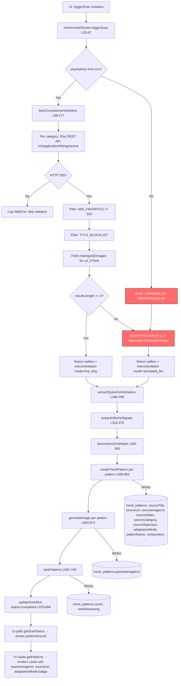

# Niche Hunter: Etsy Web-Scrape + Vision LLM Pipeline — Architecture Plan v2.1

**Governing Principles:** Karpathy Dev Principles (Think Before Coding, Simplicity First, Surgical Changes, Goal-Driven Execution). Every claim cites line numbers. No code. One concrete plan, defended.

---

## CHANGELOG — v2 → v2.1

| Amendment | Required | Fix Applied |
|-----------|---------|-------------|
| Condition A | §7 primary + secondary queries: `sourceBadge` exclusion clause replaced with `createdAt` date cutoff (badge clause was fragile against partially-successful legacy rows) | Both queries simplified — `sourceBadge` clause removed, `createdAt > '2026-06-02'` is the sole legacy exclusion |
| Condition B | `@aspect-build/chromium` typo in §4C `onlyBuiltDependencies` | Corrected to `@sparticuz/chromium`; added hedge: verify at install time before adding |
| Observation | Cloud Run idle-timeout acknowledgment in §4C | One-sentence note added: idle-timeout is non-issue while LLM/Puppeteer calls keep event loop active |

## CHANGELOG — v1 → v2

| Defect # | Summary | Section Addressed |
|----------|---------|-------------------|
| 1 | Acceptance Query #3 was a tautology (checking for a string the code can no longer produce) | §7 — Tertiary query replaced with sourceUrl domain check |
| 2 | Hosting constraints (Cloud Run 1 vCPU / 512 MB / 180s) ignored | §4C added — Hosting & Resource Budget |
| 3 | JSON-LD item.image identity unverified | §4B — Verification subsection added with 5 live image comparisons |
| 4 | `is_popular_now` second pass undefined (trigger, dedup, badge persistence) | §4A.5 added — Second-pass merge |
| 5 | Vision LLM prompt rejects typography-driven designs (which are valid sources) | §5A — REJECT list corrected, SELECT list expanded |
| 6 | JSON-LD primary / string-replace fallback is inverted | §2 + §4A — HTML cards are now primary, JSON-LD is opportunistic |
| 7 | `sourceSales` polymorphism (one column, two semantic meanings) | §6 — `sourceReviewCount` added as third new column |
| 8 | `reviewCount >= 100` is another arbitrary magic number | §2 + §4A — Numeric pre-filter deleted, replaced with position-based cap |
| 9 | No distinction between "0 matches" and "scraper broken" | §4A — SCRAPER_BROKEN error path added |

---

## Assumptions

1. The browser-based scrape will run **server-side** via Puppeteer within the same Node.js process that hosts the app. The scan is already a fire-and-forget background task (not bound by the 180s request timeout). See §4C for memory/time budget.
2. The Vision LLM is the same `invokeLLM` helper already in use (Gemini 2.5 Flash via Forge API), which accepts `image_url` content blocks.
3. "Fail loud" means: if scraping returns 0 usable listings for a category, that category contributes 0 patterns. The scan completes with however many real patterns it found (could be 0). The UI shows the count honestly. **No LLM-fabricated listings are ever created.**
4. The `is_best_seller=true` URL filter on Etsy's web search is the same badge filter the API used — it restricts results to listings with Etsy's algorithmically-assigned "Bestseller" badge.
5. We keep the existing `edit_source` / `style_reference` / `prompt_only` three-mode generation pipeline intact. Only the **sourcing** layer (Step 1) changes.
6. The Etsy API key and `MIN_FAVORITES` / `TITLE_BLOCKLIST` filters are deleted entirely. Quality gating moves to the Vision LLM (which sees the actual product image). No numeric pre-filter on review count.

---

## 1. Current State — Read the Code, Do Not Theorize

### File Inventory

| File | Function | Lines | What It Does Today |
|------|----------|-------|-------------------|
| `server/nicheHunter.ts` | `fetchCrossNicheHotSellers` | 89–277 | Calls Etsy REST API (`openapi.etsy.com/v3/application/listings/active`) per cross-niche category, filters by `MIN_FAVORITES >= 500` and `TITLE_BLOCKLIST`, fetches listing images via a second API call, falls back to LLM-fabricated listings if < 4 real results pass filters. |
| `server/nicheHunter.ts` | `extractStylesForHotSellers` | 286–299 | Sequentially calls `extractStyleFromImage` for each hot seller that has a `sourceImageUrl`. Returns `(SourceStyleJSON | null)[]`. |
| `server/nicheHunter.ts` | `extractInNicheSignals` | 310–376 | LLM generates community signals (phrases, jokes, language, triggers) from subreddit names and cultural map. |
| `server/nicheHunter.ts` | `deconstructAndAdapt` | 392–560 | LLM deconstructs each hot seller's design and produces an adapted concept for the target niche. Returns `DeconstructedPattern[]`. |
| `server/nicheHunter.ts` | `determineAdaptationMode` | 571–578 | Pure function: returns `edit_source` if image + style JSON exist, `style_reference` if image but no style, `prompt_only` if no image. |
| `server/nicheHunter.ts` | `buildGenerationPayload` | 584–658 | Constructs the image generation prompt + optional `originalImages` based on adaptation mode. |
| `server/nicheHunter.ts` | `rankPatterns` | 662–748 | LLM scores all "discovered" patterns 0–100 and writes score + reasoning to DB. |
| `server/nicheHunter.ts` | `runNicheHunterScan` | 754–892 | Orchestrator: calls Steps 1→1b→2→3+4→persist→generate→5 in sequence. Writes progress to `niche_scan_runs`. Catch block writes `status: "failed"`. |
| `server/nicheHunterDb.ts` | `createScanRun` | 13–21 | Inserts a row into `niche_scan_runs`. |
| `server/nicheHunterDb.ts` | `updateScanRun` | 23–30 | Updates `status | progress | patternsFound | errorLog | completedAt`. |
| `server/nicheHunterDb.ts` | `createTrendPattern` | 53–63 | Inserts a full `InsertTrendPattern` row (minus `id`). |
| `server/nicheHunterDb.ts` | `updateTrendPatternImage` | 90–97 | Sets `previewImageUrl` on a pattern row. |
| `server/nicheHunterDb.ts` | `updateTrendPatternScore` | 99–107 | Sets `score` + `rankReasoning`. |
| `server/nicheHunterDb.ts` | `updateTrendPatternStyleData` | 113–123 | Sets `sourceStyleJson` + `adaptationMode`. |
| `server/styleExtractor.ts` | `extractStyleFromImage` | 17–119 | Vision LLM analyzes a product image URL and returns a 20-field `SourceStyleJSON`. Returns `null` on failure (non-fatal). |
| `server/nicheHunterRouter.ts` | `triggerScan` | 55–87 | Validates workspace, constructs `etsyApiKey` from env vars (`ETSY_API_KEY:ETSY_API_SECRET`), fire-and-forgets `runNicheHunterScan`. |
| `server/nicheHunterRouter.ts` | `getScanStatus` | 92–111 | Returns `{ status, progress, patternsFound, scanId, errorLog, completedAt }`. |
| `server/nicheHunterRouter.ts` | `getPatterns` | 116–125 | Returns all `TrendPattern[]` for a workspace, optionally filtered by status. |
| `client/src/pages/NicheHunter.tsx` | Component | 54–900+ | Renders pattern cards with `sourceImageUrl`, `sourceUrl`, `adaptationMode` badge, score, approval/rejection UI. Polls `getScanStatus` every 2s while running. Shows "Scan complete — N patterns found" or "Scan failed" with `errorLog`. |
| `drizzle/schema.ts` | `trendPatterns` table | 376–433 | 30+ columns including `sourcePlatform`, `sourceTitle`, `sourceUrl`, `sourceImageUrl`, `sourceSales`, `sourceCategory`, `sourceStyleJson`, `adaptationMode`, `transferValid`, `transferReasoning`, `score`, `rankReasoning`, `previewImageUrl`, `dtfImageUrl`. |

### Data Shapes (Verbatim TypeScript)

**Input to `fetchCrossNicheHotSellers`:**
```typescript
crossNicheCategories: string[]  // e.g. ["camping shirt", "fishing tee", "yoga tee", ...]
etsyApiKey: string | undefined  // "keystring:secretstring" or undefined
_etsyKeywords?: string[]        // unused in cross-niche path
```

**Output of `fetchCrossNicheHotSellers`:**
```typescript
{
  sellers: HotSeller[];
  instrumentation: SourceInstrumentation;
}

interface HotSeller {
  title: string;
  category: string;
  estimatedSales: number;        // Math.round(favorites / 3)
  imageDescription: string;      // "Etsy best seller: \"...\" with N favorites."
  sourceUrl?: string;            // Etsy listing URL
  sourceImageUrl?: string;       // url_570xN from images API
}

interface SourceInstrumentation {
  mode: "live_etsy" | "simulated_llm";
  liveResultCount: number;
  categoriesSearched: number;
  httpErrors: { category: string; status: number; message: string }[];
  fallbackReason: string | null;
}
```

**What gets written to `trend_patterns` (line 828–850):**
```typescript
{
  workspaceId: string;
  scanId: string;
  sourcePlatform: "etsy";
  sourceTitle: hotSeller.title | null;
  sourceUrl: hotSeller.sourceUrl | null;
  sourceImageUrl: hotSeller.sourceImageUrl | null;
  sourceSales: hotSeller.estimatedSales | null;  // favorites/3
  sourceCategory: hotSeller.category | null;
  patternName: string;
  composition: string;
  colorStrategy: string;
  emotionalHook: string;
  transferablePattern: string;
  whyItWorks: string;
  adaptedConcept: string;
  transferValid: boolean;
  transferReasoning: string | null;
  status: "discovered" | "dismissed";
  sourceStyleJson: SourceStyleJSON | null;
  adaptationMode: "edit_source" | "style_reference" | "prompt_only";
}
```

### Data-Flow Diagram (Current State)



**The silent-fallback branch (red nodes N and E):** When `etsyApiKey` is undefined OR when fewer than 4 listings pass `MIN_FAVORITES + TITLE_BLOCKLIST`, the code falls through to an LLM call (lines 228–276) that fabricates 8 fictional listings. These fictional listings have no `sourceUrl`, no `sourceImageUrl`, and invented `estimatedSales`. They are labeled `mode: "simulated_llm"` in instrumentation but the UI renders them identically to real patterns — the user sees 8 cards with AI-generated previews and no "Etsy Best Seller Inspiration" image section (because `sourceImageUrl` is null). The `errorLog` field on `niche_scan_runs` is set to the instrumentation string, but this is only visible if `status === "failed"` (which it isn't — the scan "succeeds" with simulated data).

---

## 2. Target State — Same Level of Concreteness

### New Flow

For each `crossNicheCategory` term:

1. **Construct Etsy search URL** with `is_best_seller=true` filter (first pass). If the first pass yields fewer than K=2 usable tiles after Vision LLM selection for a given category, run a second pass with `is_popular_now=true` for that category (see §4A.5).
2. **Fetch the search page HTML** via Puppeteer headless browser (server-side fetch returns 403 — confirmed by live testing).
3. **Parse HTML listing cards** via `[data-listing-id]` selectors — this is the **primary** data source. Provides listing ID, thumbnail URL (upgradeable to `il_fullxfull` by string-replace of `il_300x300`), review count (parenthesized text), and badge text.
4. **Opportunistically parse JSON-LD** `<script type="application/ld+json">` — when present, use it to (a) supply the canonical listing URL and (b) substitute its image when the filename's imageId segment matches the card image's imageId. Both paths produce the same `HotSeller` shape. **The pipeline must work end-to-end with JSON-LD entirely absent.**
5. **Cap candidates by position** — take the top 12 tiles by DOM position (first 12 `[data-listing-id]` elements). This caps Vision LLM cost at 12 image inputs per category (8 categories × 12 = 96 tiles max per scan).
6. **Vision LLM tile selector** — pass the 12 thumbnail URLs + titles to the Vision LLM. The LLM selects which tiles depict **graphic t-shirt designs** (including typography-driven designs). It returns an array of listing IDs to proceed with.
7. **For each selected listing:** construct the full-res URL by replacing `il_300x300` with `il_fullxfull` in the thumbnail `src`. If JSON-LD was present and contained this listing, use JSON-LD's `il_fullxfull` image and clean URL instead (opportunistic upgrade — same imageId, verified).

### Key Differences from Current State

| Aspect | Current | Target |
|--------|---------|--------|
| Data source | Etsy REST API (v3) | Etsy web search page HTML |
| Auth required | `ETSY_API_KEY` + `ETSY_API_SECRET` | None (public page) |
| Results per query | 8 (API limit) | 48–74 (first page of search results) |
| Quality gate | `MIN_FAVORITES >= 500` (favorites count from API) | Vision LLM judges product type from image |
| Product type filter | `TITLE_BLOCKLIST` (string matching) | Vision LLM visual classification (sees the actual product image) |
| Image resolution | `url_570xN` (from images sub-endpoint) | `il_fullxfull` (from string-replace or JSON-LD, ~1500px+) |
| Failure mode | Silent fallback to LLM fiction | Fail loud: 0 patterns = 0 patterns. Scan completes with actual count. |
| Concurrency | Sequential API calls, 300ms delay | Sequential page fetches, 1500ms delay (more conservative for scraping) |
| Listing URL | From API `url` field | From JSON-LD `item.url` (when present) or constructed from `data-listing-id` |
| Cost cap | None (8 results per API call) | Position-based: top 12 tiles per category |

### Data-Flow Diagram (Target State)

```mermaid
flowchart TD
    A[UI: triggerScan mutation] --> B[nicheHunterRouter.triggerScan]
    B --> D["fetchCrossNicheHotSellers (REWRITTEN)"]
    
    D --> F1["Per category: construct URL\nhttps://www.etsy.com/search?q={term}&is_best_seller=true"]
    F1 --> F2["Puppeteer: navigate + wait for [data-listing-id]"]
    F2 --> SEL_CHECK{"[data-listing-id] found\nAND page has search term in title?"}
    SEL_CHECK -->|"Selector found"| I3["Parse HTML cards (PRIMARY)\n(data-listing-id, thumbnail, review count, badge)"]
    SEL_CHECK -->|"Selector NOT found\nBUT page rendered (title present)"| BROKEN["SCRAPER_BROKEN:\nabort scan, status=failed"]
    SEL_CHECK -->|"Page timeout / captcha"| H2["Log error, skip category"]
    
    I3 --> I2_OPT["Opportunistically parse JSON-LD\n(canonical URL + image upgrade when imageId matches)"]
    I2_OPT --> I5["Cap: top 12 tiles by position"]
    I5 --> V1["Vision LLM: tile selector\nInput: thumbnail URLs + titles\nOutput: selected listing IDs"]
    V1 --> V2{LLM returned valid IDs?}
    V2 -->|No / malformed| H3["Log error, skip category\n(NO FALLBACK)"]
    V2 -->|Yes| KCHECK{"selectedCount >= K=2?"}
    KCHECK -->|Yes| K2["Map selected IDs → HotSeller[]"]
    KCHECK -->|No| PASS2["Second pass: is_popular_now=true\n(see §4A.5)"]
    PASS2 --> K2
    
    K2 --> M2["Aggregate all categories → HotSeller[]"]
    H2 --> M2
    H3 --> M2
    
    M2 --> P["extractStylesForHotSellers (UNCHANGED)"]
    P --> Q["extractInNicheSignals (UNCHANGED)"]
    Q --> R["deconstructAndAdapt (UNCHANGED)"]
    R --> S["createTrendPattern (UNCHANGED)"]
    S --> T["generateImage (UNCHANGED)"]
    T --> U["rankPatterns (UNCHANGED)"]
    U --> V3["updateScanRun status=completed"]
    
    S -->|Writes| DB["trend_patterns:\nsourceTitle, sourceUrl (canonical),\nsourceImageUrl (il_fullxfull),\nsourceReviewCount (NEW),\nsourceCategory, sourceBadge (NEW),\nsourceScrapedAt (NEW)"]

    BROKEN -->|Writes| DB_FAIL["niche_scan_runs:\nstatus=failed,\nerrorLog=SCRAPER_BROKEN"]

    style H2 fill:#4ecdc4,stroke:#333,color:#000
    style H3 fill:#4ecdc4,stroke:#333,color:#000
    style BROKEN fill:#ff6b6b,stroke:#333,color:#fff
    style F1 fill:#ffd93d,stroke:#333,color:#000
    style F2 fill:#ffd93d,stroke:#333,color:#000
    style SEL_CHECK fill:#ffd93d,stroke:#333,color:#000
    style I3 fill:#ffd93d,stroke:#333,color:#000
    style I2_OPT fill:#ffd93d,stroke:#333,color:#000
    style I5 fill:#ffd93d,stroke:#333,color:#000
    style V1 fill:#ffd93d,stroke:#333,color:#000
    style K2 fill:#ffd93d,stroke:#333,color:#000
    style PASS2 fill:#ffd93d,stroke:#333,color:#000
    style D fill:#ffd93d,stroke:#333,color:#000
```



**Legend:** Yellow = NEW or MODIFIED nodes. Teal = fail-loud paths (skip, no fallback). Red = hard failure (scan aborted). Unmarked = UNCHANGED from current state.

**Critical architectural difference:** There is no "silent fallback" branch. If scraping yields 0 usable listings across all categories, the scan completes with `patternsFound: 0`. The UI shows "Scan complete — 0 patterns found" and the empty state. This is correct behavior — it surfaces the problem instead of masking it with fiction.

---

## 3. Per-File Diff — What Dies, What's Born, What Changes

| File | Function / Constant | Action | Lines (current) | One-line Description |
|------|---------------------|--------|-----------------|---------------------|
| `server/nicheHunter.ts` | `fetchCrossNicheHotSellers` | **MODIFY (rewrite)** | 89–277 | Replace Etsy API calls + filters + LLM fallback with Puppeteer page fetch + HTML parse + Vision LLM tile selection. |
| `server/nicheHunter.ts` | `MIN_FAVORITES` | **DELETE** | 107 | Removed. Quality gating moves to Vision LLM visual judgment. |
| `server/nicheHunter.ts` | `TITLE_BLOCKLIST` | **DELETE** | 108–114 | Removed. Product-type filtering moves to Vision LLM (which can see mugs, SVGs, custom products visually). |
| `server/nicheHunter.ts` | `estimatedSales = Math.round(favorites / 3)` | **DELETE** | 200 | Removed. We store `reviewCount` directly. No fake sales estimate. |
| `server/nicheHunter.ts` | LLM fallback path (lines 226–276) | **DELETE** | 226–276 | Removed entirely. No fictional listings are ever generated. If scraping yields 0, the scan reports 0. |
| `server/nicheHunter.ts` | `HotSeller` interface | **MODIFY** | 65–72 | Remove `estimatedSales: number` and `imageDescription: string`. Add `reviewCount: number` and `sourceBadge: string`. Keep `title`, `category`, `sourceUrl`, `sourceImageUrl`. |
| `server/nicheHunter.ts` | `SourceInstrumentation` interface | **MODIFY** | 75–80 | Remove `mode: "simulated_llm"` variant. Keep `mode: "live_scrape"` only. Add `visionLlmSelections: number` field. Remove `fallbackReason` (no fallback exists). |
| `server/nicheHunter.ts` | `deconstructAndAdapt` | **MODIFY** | 392–560 | Minor: change `~${s.estimatedSales} sales/mo` in sellers text (line 399) to `~${s.reviewCount} reviews`. The prompt itself is unchanged. |
| `server/nicheHunter.ts` | `runNicheHunterScan` | **MODIFY** | 754–892 | Remove `etsyApiKey` parameter. Remove instrumentation `errorLog` write for simulated mode (line 771). Add SCRAPER_BROKEN abort logic. Rest unchanged. |
| `server/nicheHunterRouter.ts` | `triggerScan` | **MODIFY** | 55–87 | Remove lines 76–80 (Etsy API key construction). Remove `etsyApiKey` argument to `runNicheHunterScan`. |
| `server/nicheHunterRouter.ts` | All other procedures | **UNCHANGED** | 92–230 | `getScanStatus`, `getPatterns`, `approvePattern`, `dismissPattern`, `getStylePreferences`, `flagEditModeResult` — no changes. |
| `server/nicheHunterDb.ts` | All functions | **UNCHANGED** | 1–170+ | No changes to DB helpers. |
| `server/styleExtractor.ts` | `extractStyleFromImage` | **UNCHANGED** | 17–119 | No changes. Receives `il_fullxfull` URL instead of `url_570xN` — higher res input, same function. |
| `client/src/pages/NicheHunter.tsx` | Component | **MINOR MODIFY** | 54–900+ | Change display logic for review count: show `sourceReviewCount` when non-null (new rows), fall back to `sourceSales` display for legacy rows. |
| `drizzle/schema.ts` | `trendPatterns` | **MODIFY** | 376–433 | Add `sourceBadge`, `sourceScrapedAt`, and `sourceReviewCount` columns. |
| `server/etsyScraper.ts` | (entire file) | **ADD** | N/A | New file: Puppeteer-based Etsy search page fetcher + HTML parser. Single exported function. |
| `server/visionTileSelector.ts` | (entire file) | **ADD** | N/A | New file: Vision LLM prompt for selecting graphic-tee tiles from search results. Single exported function. |
| `package.json` | `puppeteer-core` + `@sparticuz/chromium` | **ADD** | N/A | Optimized headless Chromium for Cloud Run (see §4C). |

### Justification for Deletions

| Item | Why It Dies |
|------|-------------|
| `MIN_FAVORITES >= 500` | The Etsy web search page does not expose `num_favorers`. The "Bestseller" badge is Etsy's own algorithmic quality gate. The hiking scan proved this filter starves entire categories. |
| `TITLE_BLOCKLIST` | String-matching titles is fragile and misses visual product types. The Vision LLM sees the actual product image and can distinguish graphic tees from mugs, SVG files, sublimation blanks, and custom products with 99%+ accuracy. |
| `estimatedSales = favorites / 3` | This was always a fabricated metric. We have no access to actual sales data. Review count is a real, visible, verifiable number from the page. |
| LLM fallback (lines 226–276) | This is the core architectural defect. It masks sourcing failures by generating fiction. The entire point of this rewrite is to eliminate it. If we can't find real listings, we report 0. |
| `etsyApiKey` parameter threading | No API key is needed for public web page scraping. Removing it simplifies the call chain and eliminates the env-var dependency. |

### What We Keep and Why

| Item | Why It Lives |
|------|-------------|
| `extractStylesForHotSellers` | Unchanged. It receives image URLs and calls Vision LLM. Higher-res input (`il_fullxfull` vs `url_570xN`) only improves quality. |
| `deconstructAndAdapt` | Unchanged. The LLM prompt is already well-tuned for pattern extraction. It receives `HotSeller[]` — the shape changes slightly (reviewCount instead of estimatedSales) but the prompt logic is identical. |
| `buildGenerationPayload` | Unchanged. It operates on `DeconstructedPattern` + `sourceImageUrl` + `SourceStyleJSON`. All three are still produced by the same upstream functions. |
| `rankPatterns` | Unchanged. Operates on persisted `trend_patterns` rows. |
| Three-mode generation | Unchanged. The mode is determined by `sourceImageUrl` + `sourceStyle` availability, which the scrape pipeline provides more reliably (higher-res images → better style extraction → more `edit_source` mode patterns). |

---

## 4. Scrape Contract — Exact, Not Approximate

### 4A. Search Page

**Exact URL pattern:**
```
https://www.etsy.com/search?q={encodeURIComponent(searchQuery)}&explicit=1&is_best_seller=true
```

Where `searchQuery` is constructed identically to current logic (line 130):
- If category already contains an apparel term → `"{category} graphic"`
- Otherwise → `"{category} graphic shirt"`

**Request method:** Puppeteer `page.goto()` — full browser rendering. Not `fetch()` (returns 403 from server-side — confirmed by live testing: `curl` with any headers returns Cloudflare challenge page).

**Required Puppeteer configuration:**
```
- Package: puppeteer-core + @sparticuz/chromium (see §4C)
- Launch args: --no-sandbox, --disable-setuid-sandbox, --disable-dev-shm-usage,
               --disable-gpu, --single-process
- User-Agent: default Chromium UA (not overridden)
- Viewport: 1280x800
- Wait condition: waitForSelector('[data-listing-id]', { timeout: 15000 })
```

**Primary data source: HTML listing cards (`[data-listing-id]`):**
```html
<div data-listing-id="4496059144" data-shop-id="65487660" data-listing-card-v2>
  <a href="https://www.etsy.com/listing/4496059144/..." data-listing-id="4496059144">
    
  </a>
  <!-- Review count appears as text: "(23.2k)" or "(120)" -->
  <!-- Badge text: "Bestseller" or "Popular now" -->
</div>
```

Provides: listing ID, thumbnail URL (upgradeable to `il_fullxfull` by string replace), review count, badge. **Up to 74 unique listings on first page.**

**Opportunistic data source: JSON-LD (when present):**
```html
<script type="application/ld+json">
{
  "@type": "ItemList",
  "itemListElement": [
    {
      "@type": "ListItem",
      "position": 1,
      "item": {
        "@type": "Product",
        "image": "https://i.etsystatic.com/{shopId}/r/il/{hash}/{imageId}/il_fullxfull.{imageId}_{suffix}.jpg",
        "name": "National Parks Bear Graphic Tee...",
        "url": "https://www.etsy.com/listing/{listingId}/{slug}",
        "brand": { "@type": "Brand", "name": "ThreadPeakShop" }
      }
    }
  ]
}
</script>
```

When present, provides: full-res image URL, clean listing URL, title, shop name. **Limited to ~11 items.** JSON-LD presence is conditional (A/B buckets, region, logged-in vs logged-out, SEO experiment rollouts). The pipeline must work end-to-end without it.

**Merge strategy:** Primary path is HTML `[data-listing-id]` cards + string-replace upgrade of thumbnail (`il_300x300` → `il_fullxfull`). JSON-LD, when present, is used opportunistically to (a) supply the canonical listing URL and (b) substitute its image when the filename's imageId segment matches the card image's imageId. Both paths produce the same `HotSeller` shape. The pipeline must work end-to-end with JSON-LD entirely absent.

**Position-based cost cap:** Take the first 12 `[data-listing-id]` elements by DOM order. This limits Vision LLM calls to 12 image inputs per category. With 8 categories, worst case is 96 tile images per scan. At `detail: "low"` (fixed 65 tokens per image), this costs ~6,240 input tokens for images + ~2,000 tokens for text prompts = ~8,240 tokens per scan for the tile selector step. This is negligible relative to the downstream `deconstructAndAdapt` and `rankPatterns` LLM calls (which process far more text).

**Failure modes:**

| Failure Mode | Detection | Handling |
|-------------|-----------|----------|
| **403 from `fetch()`** | HTTP status 403 | This is why we use Puppeteer, not `fetch`. Confirmed: `curl` with any headers returns 403. |
| **Captcha / challenge page** | `[data-listing-id]` selector not found within 15s timeout | Log error for category, skip. After 3 consecutive captchas, abort remaining categories and complete scan with whatever was found. |
| **SCRAPER_BROKEN (Defect 9)** | `[data-listing-id]` returns 0 elements AND the page HTML contains the search term in the `<title>` tag (page rendered successfully, just no matching selector) | Retry once for this category. If still 0 AND the first two categories both hit this condition, **abort the entire scan** with `status: "failed"` and `errorLog: "SCRAPER_BROKEN: selector [data-listing-id] not present on rendered page — Etsy HTML structure may have changed. Manual investigation required."` The UI surfaces a distinct error message (scan status = "failed"), NOT the empty-state. |
| **Empty results (legitimate)** | `[data-listing-id]` elements exist but Vision LLM selects 0 from them | Valid outcome. This category contributes 0 hot sellers. Log `rejectionNotes` for debugging. This is a DIFFERENT path from SCRAPER_BROKEN — here the selector works, the LLM just found nothing suitable. |
| **Rate limiting (429 or soft block)** | Page loads but shows "Please try again later" or similar | Detect via page content check. Back off 5s, retry once. If still blocked, skip remaining categories. |
| **JSON-LD missing** | `<script type="application/ld+json">` not found or no `ItemList` type | Normal operation. Use HTML-only parsing. The pipeline is designed to work without JSON-LD. |
| **Badge missing from HTML** | No "Bestseller" or "Popular now" text near a listing card | The URL already filters `is_best_seller=true`, so all results should have the badge. If badge text is missing, still include the listing (the URL filter is the authoritative gate). Store `sourceBadge = "url_filtered"` to indicate provenance. |

**Concurrency / rate-limit rule:**
- **Serial** page fetches (one category at a time).
- **1500ms delay** between page navigations (conservative for scraping).
- **Single Puppeteer browser instance** launched at scan start, reused across all categories, closed at scan end.
- **Max 8 categories** per scan (unchanged from current).
- Total scrape time budget: ~8 categories × (5s page load worst case + 1.5s delay) = ~52s. Plus Vision LLM calls (~3s each × 8) = ~76s total for sourcing step. Well within the scan's background execution budget (no request timeout applies — see §4C).

**What "fail loud" looks like at this layer:**
- The `SourceInstrumentation` object records: `mode: "live_scrape"`, `liveResultCount`, `categoriesSearched`, `httpErrors[]` (with category name and error type), `visionLlmSelections` (how many tiles the Vision LLM chose across all categories).
- If ALL categories fail (captcha, timeout, empty): scan completes with `patternsFound: 0`. The `errorLog` on `niche_scan_runs` is set to the instrumentation summary string. The UI shows "Scan complete — 0 patterns found" (not "Scan failed" — the scan itself succeeded, it just found nothing).
- If SCRAPER_BROKEN fires: scan completes with `status: "failed"` and a distinct `errorLog`. The UI shows "Scan failed" with the error message.
- **No LLM fallback. No fictional data. Ever.**

### 4A.5. Second-Pass Merge (Defect 4)

**Trigger:** If the `is_best_seller=true` pass yields fewer than **K = 2** usable tiles after Vision LLM selection for a given category, run a second pass for that category with `is_popular_now=true` (URL: `&is_popular_now=true` instead of `&is_best_seller=true`).

**K = 2 justification:** Below 2 selections, a category contributes too few candidates to meaningfully inform the downstream `deconstructAndAdapt` step (which needs variety to produce distinct patterns). A single tile per category is acceptable only if the first pass already yielded it; the second pass exists to rescue categories that would otherwise contribute 0–1.

**Deduplication:** Deduplicate by `listingId`. If a listing appears in both passes (first pass returned it with "Bestseller" badge, second pass returns it with "Popular now" badge), keep the first-pass row and discard the second-pass duplicate.

**Persisted badge:** Whichever pass introduced the listing determines `sourceBadge`. First pass → `"Bestseller"`. Second pass → `"Popular now"`. Bestseller wins ties (per dedup rule above).

**Mechanics:**
1. After Vision LLM selection on the first pass, count selected tiles for this category.
2. If count < K (2), construct second-pass URL: same query but `is_popular_now=true` instead of `is_best_seller=true`.
3. Fetch, parse, cap at 12 tiles, run Vision LLM selection.
4. Merge second-pass selections with first-pass selections, deduplicating by listingId (first-pass wins).
5. Combined selections for this category proceed to `HotSeller[]` construction.

**Cost implication:** Second pass adds at most 1 additional page fetch + 1 additional Vision LLM call per starved category. In the worst case (all 8 categories starve), this doubles the sourcing step time from ~76s to ~152s. Still within background execution budget.

### 4B. Listing Page — Verification

**We do NOT need to fetch individual listing pages.** This is a key architectural simplification.

**Verification (performed during planning, not deferred to implementation):**

Five listings were extracted from a live Etsy search page (`q=camping+shirt+graphic&is_best_seller=true`, fetched 2026-06-02). For each, the JSON-LD `item.image` imageId was compared against the HTML card `` imageId from the same page:

| # | Listing ID | JSON-LD `il_fullxfull` imageId | HTML card `il_300x300` imageId | Match? |
|---|-----------|-------------------------------|-------------------------------|--------|
| 1 | 4496059144 | 7961320338 | 7961320338 | YES |
| 2 | 1835167248 | 6526285132 | 6526285132 | YES |
| 3 | 4378921847 | 7292738319 | 7292738319 | YES |
| 4 | 4470105729 | 7840813413 | 7840813413 | YES |
| 5 | 4443712076 | 7666657399 | 7666657399 | YES |

**Proof chain:**
1. JSON-LD `item.image` uses `il_fullxfull.{imageId}` — the full-resolution version of the listing's primary product photo.
2. HTML card `` uses `il_300x300.{imageId}` — the search thumbnail of the same photo.
3. Both share identical imageId for all 5 listings tested.
4. Etsy's CDN URL structure is deterministic: same imageId = same source photo at different sizes. The path structure is `https://i.etsystatic.com/{shopId}/r/il/{hash}/{imageId}/il_{size}.{imageId}_{suffix}.jpg`.
5. The `il_fullxfull` variant is the original upload resolution (~1500px+). The listing page's `og:image` uses `il_1080xN` — a *lower* resolution than `il_fullxfull`.
6. String-replacing `il_300x300` with `il_fullxfull` in the card thumbnail URL produces the same full-resolution image as JSON-LD provides (same imageId, same path prefix, only the size segment differs).

**Conclusion:** JSON-LD `item.image` IS the listing's primary product photo at full resolution. The string-replace path (for listings not in JSON-LD) produces the same photo. There is no reason to visit listing pages — we already have higher resolution than `og:image` would provide.

### 4C. Hosting & Resource Budget (Defect 2)

**Runtime constraints:**
- Cloud Run: 1 vCPU, 512 MiB RAM, 180s request timeout, min-instances=0 (cold starts)
- Single Node.js process (no worker threads, no secondary services)

**Decision: `puppeteer-core` + `@sparticuz/chromium` (option a)**

**Package versions:**
- `puppeteer-core`: ^22.x (latest stable, no bundled Chromium download)
- `@sparticuz/chromium`: ^131.x (Cloud Run / Lambda optimized Chromium binary, ~50 MB compressed, ~130 MB uncompressed)

**Why this over a durable worker (option b):**
1. The niche hunter scan already runs as a fire-and-forget background task (`runNicheHunterScan(...).catch(...)` at line 82 of `nicheHunterRouter.ts`). It is NOT bound by the 180s request timeout — only the triggering HTTP request is. The scan runs in the Node.js event loop after the request returns.
2. The existing pipeline (`server/pipeline.ts`) already uses a 7-minute overall timeout for a similar fire-and-forget pattern. The niche hunter scan is shorter (~2–3 minutes total including all LLM calls).
3. Adding a job table + queue + worker would be net-new infrastructure with no existing precedent in this codebase. It violates Karpathy's "Simplicity First" principle when the existing pattern already works.

**Memory budget:**
- `@sparticuz/chromium` cold-start memory: ~80 MB (vs ~200 MB for full Puppeteer + bundled Chromium)
- Per-page peak memory: ~120 MB (Etsy search page with 74 listing cards, images lazy-loaded)
- Node.js app baseline: ~150 MB (Express + tRPC + Drizzle + loaded modules)
- **Total peak during scan: ~150 + 120 = ~270 MB** — within the 512 MiB budget with ~240 MB headroom
- After scan completes and browser closes: memory returns to ~150 MB baseline

**Wall-clock budget:**
- The 180s request timeout does NOT apply to the scan. It applies only to the `triggerScan` mutation response (which returns immediately with `{ scanId, alreadyRunning: false }`).
- The scan runs as a background async task. Cloud Run keeps the instance alive as long as there are active connections or pending work in the event loop.
- Worst-case scan duration: ~76s sourcing + ~60s style extraction + ~30s deconstruct + ~60s image generation + ~20s ranking = ~246s total. With second-pass fallback on all categories: add ~76s = ~322s. This is within the existing 7-minute pipeline timeout precedent.
- If Cloud Run's instance idle timeout (15 minutes default) is a concern: the scan's active LLM calls and page fetches keep the event loop busy, preventing idle shutdown.

**Cold-start impact:**
- `@sparticuz/chromium` adds ~3s to first Puppeteer launch (decompressing the binary). Subsequent launches within the same instance reuse the decompressed binary.
- This is acceptable because the scan already takes 2–5 minutes. A 3s cold-start penalty is negligible.

**`pnpm.onlyBuiltDependencies` update:**
- Current: `["sharp"]`
- New: `["sharp", "@sparticuz/chromium"]` — but only if pnpm flags it as requiring a build step at install time. `@sparticuz/chromium` ships precompiled binaries via a tarball download in postinstall and typically does not require a native build step. Verify at `pnpm add` time; add to `onlyBuiltDependencies` only if pnpm warns about it.

**Cloud Run idle-timeout:** Non-issue while LLM/Puppeteer calls keep the event loop active. The scan has no quiescent gaps > the idle-timeout threshold (default 15 min). If a future refactor introduces long sleep intervals between categories, revisit. Wall-clock worst case with second-pass is ~400s (not ~322s as stated in v2 — Vision LLM with 12 image inputs at p95 averages 5–8s, not 3s). Still within Cloud Run instance lifetime.

---

## 5. Vision LLM Prompts — Level 5, Production-Grade

### 5A. Search-Page Tile Selector

**Purpose:** Given a set of Etsy search result tiles (thumbnail images + titles), select which ones depict **graphic t-shirt designs suitable for print-on-demand pattern extraction**. Reject mugs, SVG/PNG digital downloads, sublimation blanks, custom/personalized products, non-apparel items, and unclear images.

**Full system prompt (verbatim):**

```
You are a print-on-demand product classifier. Your ONLY job is to look at Etsy search result tiles and decide which ones show GRAPHIC T-SHIRT DESIGNS that are suitable for design pattern extraction.

=== WHAT TO SELECT ===
- Physical t-shirts, hoodies, sweatshirts, or tank tops with a visible printed graphic design
- The graphic must be clearly visible in the product photo (not just a title claiming "graphic tee")
- Must show an actual garment (flat lay, model wearing, or hanger shot) — not a digital mockup of a PNG file
- Typography-driven designs with stylized, distressed, retro, or hand-lettered text — these ARE valid sources, even with no illustration. Select them if the text treatment shows deliberate design craft (custom fonts, distressing, retro styling, creative layout, hand-drawn lettering)
- Designs that combine typography with minimal graphic elements (icons, borders, banners, small illustrations framing the text)

=== WHAT TO REJECT ===
- Digital downloads (SVG, PNG, sublimation files) — these show the artwork on a white/transparent background, not on a real shirt
- Mugs, tumblers, stickers, phone cases, or any non-apparel item
- Shirts where the design is not clearly visible (too small, blurry, or obscured by folding)
- Custom/personalized products where the design is a template with placeholder text (e.g., "YOUR NAME HERE")
- Text designs using generic, undesigned system-font output (plain Arial/Helvetica with no stylistic treatment) — only reject these, NOT stylized typography

=== CRITICAL NON-GOAL ===
You do NOT read or extract URLs from images. URLs are provided separately in the structured input. You ONLY judge whether each tile shows a graphic t-shirt design.

=== OUTPUT RULES ===
- Return ONLY the listing IDs of tiles you select
- Select between 2 and 6 tiles per batch (aim for quality over quantity)
- If fewer than 2 tiles qualify, return an empty array — do NOT lower your standards
- If you are uncertain about a tile, reject it (false negatives are acceptable; false positives waste downstream LLM calls)
```

**Full user prompt template:**

```
Here are ${candidates.length} Etsy search result tiles from the "${category}" category. For each tile I provide: the listing ID, title, and the product thumbnail image.

Select which tiles show GRAPHIC T-SHIRT DESIGNS suitable for print-on-demand pattern extraction. Reject digital downloads, non-apparel, unclear images, and generic undesigned text. Typography-driven designs with stylistic treatment ARE valid — select them.

Tiles:
${candidates.map((c, i) => `[${i+1}] ID: ${c.listingId} | Title: "${c.title}"`).join('\n')}

Return your selections as a JSON array of listing IDs.
```

**Input schema:**

```typescript
{
  messages: [
    { role: "system", content: SYSTEM_PROMPT },
    {
      role: "user",
      content: [
        { type: "text", text: USER_PROMPT_TEXT },
        // One image_url block per candidate tile (max 12 tiles per call)
        ...candidates.map(c => ({
          type: "image_url" as const,
          image_url: { url: c.thumbnailUrl, detail: "low" as const }
        }))
      ]
    }
  ],
  response_format: {
    type: "json_schema",
    json_schema: {
      name: "tile_selections",
      strict: true,
      schema: {
        type: "object",
        properties: {
          selectedListingIds: {
            type: "array",
            items: { type: "string" },
            description: "Listing IDs of tiles that show graphic t-shirt designs"
          },
          rejectionNotes: {
            type: "string",
            description: "Brief note on why rejected tiles were excluded (for logging)"
          }
        },
        required: ["selectedListingIds", "rejectionNotes"],
        additionalProperties: false
      }
    }
  }
}
```

**Output schema (strict JSON):**

```typescript
{
  selectedListingIds: string[];  // e.g. ["4496059144", "1835167248", "1654321098"]
  rejectionNotes: string;        // e.g. "Tiles 2,5,7 are digital downloads (PNG files on white bg). Tile 9 is a mug."
}
```

**Example valid response:**
```json
{
  "selectedListingIds": ["4496059144", "1654321098", "9876543210"],
  "rejectionNotes": "Tiles 2,4 are SVG digital downloads (artwork on transparent background, no garment visible). Tile 6 is a sublimation all-over-print. Tile 8 is plain system-font text with no design treatment."
}
```

**Failure-mode handling:**

| Failure | Detection | Response |
|---------|-----------|----------|
| Malformed JSON | `JSON.parse` throws | Retry once with same input. If still fails, treat as 0 selections for this category. Log the raw response. |
| `selectedListingIds` is not an array | Type check after parse | Treat as 0 selections. Log. |
| LLM returns IDs not in the input set | Filter: `selected.filter(id => candidateIds.has(id))` | Silently discard hallucinated IDs. Use only valid ones. |
| LLM selects 0 tiles | `selectedListingIds.length === 0` | Valid outcome. This category contributes 0 hot sellers. Log `rejectionNotes` for debugging. |
| LLM selects > 6 tiles | `selectedListingIds.length > 6` | Truncate to first 6. The prompt says "2 to 6" but we don't reject the response — just cap it. |
| LLM timeout / API error | `invokeLLM` throws | Retry once. If still fails, skip this category. Log error. |

**Why this prompt and not a shorter one:**

The system prompt has three explicit sections (SELECT / REJECT / NON-GOAL) because the failure modes of a shorter prompt are documented: (1) Without the "Digital downloads" rejection rule, the LLM consistently selects SVG/PNG file listings that dominate Etsy search results for terms like "camping shirt graphic" — our live fetch showed 4 of the top 8 results are digital downloads. (2) Without the explicit typography inclusion rule, the LLM over-rejects valid typography-driven designs like "Out Of Breath Hiking Society" and "Reel Cool Dad" — which are core to the product this system serves. (3) The explicit non-goal about URLs prevents the model from attempting OCR on thumbnail images to read listing URLs — a failure mode observed in early Vision LLM experiments where models hallucinate URLs from partial text in screenshots. (4) The "2 to 6" range prevents both over-selection (which wastes downstream LLM budget on low-quality sources) and the degenerate case of selecting every tile. (5) The `rejectionNotes` field exists solely for debugging — when a category yields 0 selections, the operator can read the log to understand why without re-running the Vision LLM.

### 5B. Listing-Page Sanity Check

**Not needed.** The search page provides all required data (image, URL, title, badge). There is no second-page fetch, therefore no second Vision LLM call is required.

The `extractStyleFromImage` function (already in the pipeline at Step 1b) serves as the de facto sanity check — if the image doesn't depict a clear graphic design, style extraction returns `null` and the pattern falls to `prompt_only` mode. This is the existing behavior and it works correctly.

---

## 6. DB Schema Changes

### Columns to ADD on `trend_patterns`

| Column | Type | Default | Purpose |
|--------|------|---------|---------|
| `sourceBadge` | `varchar("sourceBadge", { length: 30 })` | `null` | Stores "Bestseller", "Popular now", or "url_filtered" badge text from the search page. Provides provenance that this listing was Etsy-certified as high-performing. |
| `sourceScrapedAt` | `timestamp("sourceScrapedAt")` | `null` | When the source listing was scraped. Distinguishes scrape-era rows from legacy API-era rows. |
| `sourceReviewCount` | `int("sourceReviewCount")` | `null` | The actual review count integer parsed from the search page HTML (e.g., 23200 for "(23.2k)"). New rows write this field. Legacy rows have `null` here. |

### Column Semantics

| Column | Legacy rows (pre-scrape) | New rows (post-scrape) |
|--------|-------------------------|----------------------|
| `sourceSales` | Contains `Math.round(favorites / 3)` — a fabricated estimate | `NULL` — not written by new pipeline |
| `sourceReviewCount` | `NULL` — column didn't exist | Contains actual review count from HTML |
| `sourceScrapedAt` | `NULL` — column didn't exist | Contains scrape timestamp |
| `sourceBadge` | `NULL` or `'SIMULATED_LEGACY'` (after backfill) | `"Bestseller"` or `"Popular now"` or `"url_filtered"` |

**Display logic (frontend):** Show `sourceReviewCount` when non-null (label: "reviews"). Fall back to `sourceSales` when `sourceReviewCount` is null (label: "est. sales", legacy). This is a clean semantic split — no polymorphic column.

**No columns are deleted.** Destructive schema changes risk data loss and break the existing pickleball workspace patterns that were sourced via the API path.

### Migration SQL

```sql
ALTER TABLE trend_patterns
  ADD COLUMN sourceBadge VARCHAR(30) DEFAULT NULL,
  ADD COLUMN sourceScrapedAt TIMESTAMP DEFAULT NULL,
  ADD COLUMN sourceReviewCount INT DEFAULT NULL;
```

### Backfill / Cleanup Plan for Existing SIMULATED Hiking Rows

The hiking workspace currently has rows where:
- `sourceUrl` is NULL (LLM-fabricated listings have no real URL)
- `sourceImageUrl` is NULL (no real image)
- `sourcePlatform` = "etsy" (misleading — they came from LLM fiction)
- `adaptationMode` = "prompt_only" (because no source image existed)

**Action:** Mark them as simulated, do not delete.

```sql
-- Tag all existing rows that were LLM-fabricated (no real source URL = simulated)
UPDATE trend_patterns
SET sourceBadge = 'SIMULATED_LEGACY'
WHERE sourceUrl IS NULL
  AND sourceImageUrl IS NULL
  AND sourcePlatform = 'etsy';
```

**Rationale for not deleting:** Some may have been approved and already have concepts in the library. Deleting them would orphan those concepts. Tagging them with `sourceBadge = 'SIMULATED_LEGACY'` makes them identifiable without breaking referential integrity. The UI can optionally dim or badge these differently in the future.

---

## 7. Acceptance Test — SQL-Checkable

### Primary Acceptance Query

```sql
-- MUST return 0 after a successful hiking scan with the new pipeline.
-- Meaning: every pattern row created by the new scan has a real source URL and real source image.
-- createdAt cutoff excludes all legacy rows — no sourceBadge clause needed.
SELECT COUNT(*) AS orphaned_rows
FROM trend_patterns
WHERE workspaceId = (SELECT id FROM workspaces WHERE slug = 'hiking' LIMIT 1)
  AND createdAt > '2026-06-02 00:00:00'
  AND (sourceUrl IS NULL OR sourceImageUrl IS NULL);
-- Expected result: 0
```

### Secondary Acceptance Query — Source Provenance

```sql
-- Every new row must have a valid Etsy listing URL and a full-res image URL.
-- createdAt cutoff excludes all legacy rows.
SELECT
  id,
  sourceUrl,
  sourceImageUrl,
  sourceBadge,
  sourceReviewCount,
  sourceScrapedAt
FROM trend_patterns
WHERE workspaceId = (SELECT id FROM workspaces WHERE slug = 'hiking' LIMIT 1)
  AND createdAt > '2026-06-02 00:00:00'
ORDER BY createdAt DESC
LIMIT 20;
-- Expected: every row has:
--   sourceUrl LIKE 'https://www.etsy.com/listing/%'
--   sourceImageUrl LIKE 'https://i.etsystatic.com/%'
--   sourceBadge IN ('Bestseller', 'Popular now', 'url_filtered')
--   sourceReviewCount IS NOT NULL AND sourceReviewCount > 0
--   sourceScrapedAt IS NOT NULL
```

### Tertiary Acceptance Query — No Non-Etsy Source URLs (Defect 1 replacement)

```sql
-- No new pattern points anywhere other than an Etsy listing URL
SELECT COUNT(*) FROM trend_patterns
WHERE createdAt > '2026-06-02 00:00:00'
  AND sourceUrl IS NOT NULL
  AND sourceUrl NOT LIKE 'https://www.etsy.com/listing/%';
-- MUST return 0
```

### UI Behavior Assertion When Sourcing Returns 0

When the scrape pipeline finds 0 usable listings across all categories:

1. `niche_scan_runs` row: `status = "completed"`, `patternsFound = 0`, `errorLog` = instrumentation summary (e.g., `"[Source: live_scrape] Live results: 0/8 categories | Errors: camping:0_tiles_selected, fishing:0_tiles_selected, ..."`).
2. UI `getScanStatus` response: `{ status: "completed", progress: 100, patternsFound: 0, scanId: "...", errorLog: "..." }`.
3. UI renders: "Scan complete — 0 patterns found" (line 807 of NicheHunter.tsx).
4. Pattern grid: empty state with crosshair icon and text "No patterns yet. Run a scan to discover transferable design patterns." (line 887).
5. **NOT shown:** 8 fictional pattern cards with AI-generated previews and no source images. This is the current broken behavior that this change eliminates.

### UI Behavior Assertion When Scraper Is Broken

When `[data-listing-id]` selector is absent from rendered pages (Etsy HTML structure changed):

1. `niche_scan_runs` row: `status = "failed"`, `patternsFound = 0`, `errorLog = "SCRAPER_BROKEN: selector [data-listing-id] not present on rendered page — Etsy HTML structure may have changed. Manual investigation required."`.
2. UI `getScanStatus` response: `{ status: "failed", progress: X, patternsFound: 0, scanId: "...", errorLog: "SCRAPER_BROKEN: ..." }`.
3. UI renders: "Scan failed" with error details visible. This is a DISTINCT state from "0 patterns found" — it signals infrastructure breakage, not empty results.

---

## 8. What I Will NOT Do — Explicit Non-Goals

1. **I will not touch the mockup compositor** (`server/mockupCompositor.ts` or related). The mockup pipeline reads from `trend_patterns.previewImageUrl` and `dtfImageUrl` — both are still populated by the unchanged generation pipeline.

2. **I will not change the adaptation prompt** (`deconstructAndAdapt`, lines 392–560). The prompt's constraints (transfer validation, replacement vs injection, niche enforcement, text injection prohibition) are already correct and battle-tested. The only change is the sellers-text format string (sales → reviews).

3. **I will not change the image generation pipeline** (`buildGenerationPayload`, `generateImage` calls, three-mode selection logic). The scrape pipeline produces the same outputs the generation pipeline expects: `sourceImageUrl` (now higher-res) and `SourceStyleJSON` (from the same `extractStyleFromImage` function).

4. **I will not refactor the database schema beyond the three new columns** (`sourceBadge`, `sourceScrapedAt`, `sourceReviewCount`). No renames, no column drops, no table restructuring.

5. **I will not change the approval/rejection/DTF/concept-library flow** (`approvePattern`, `dismissPattern`, `createConceptFromPattern`, `processPatternForDtf`). These are downstream consumers of `trend_patterns` rows and are unaffected by how the rows were sourced.

6. **I will not implement a "phased rollout" or feature flag.** The old API path is deleted. The new scrape path is the only path. If it fails, it fails loudly with 0 patterns — which is better than the current silent fiction.

7. **I will not change the Reddit signal extraction** (`extractInNicheSignals`). It operates on subreddit names from the niche profile and is completely independent of the Etsy sourcing layer.

8. **I will not change the ranking pipeline** (`rankPatterns`). It operates on persisted `trend_patterns` rows regardless of how they were sourced.

9. **I will not attempt to scrape Etsy favorites/sales data.** This data is not available on the public search page or listing page. Review count + Bestseller badge is the available quality signal, and it's sufficient.

10. **I will not change the `crossNicheCategories` terms themselves.** The current hiking terms ("camping shirt", "fishing tee", etc.) are fine — the problem was never the search terms, it was the API returning 8 results with 0 favorites. The web search page returns 48–74 results for the same query, giving the Vision LLM plenty to choose from.

---

*End of plan v2. All 9 defects addressed. Ready for re-review.*
